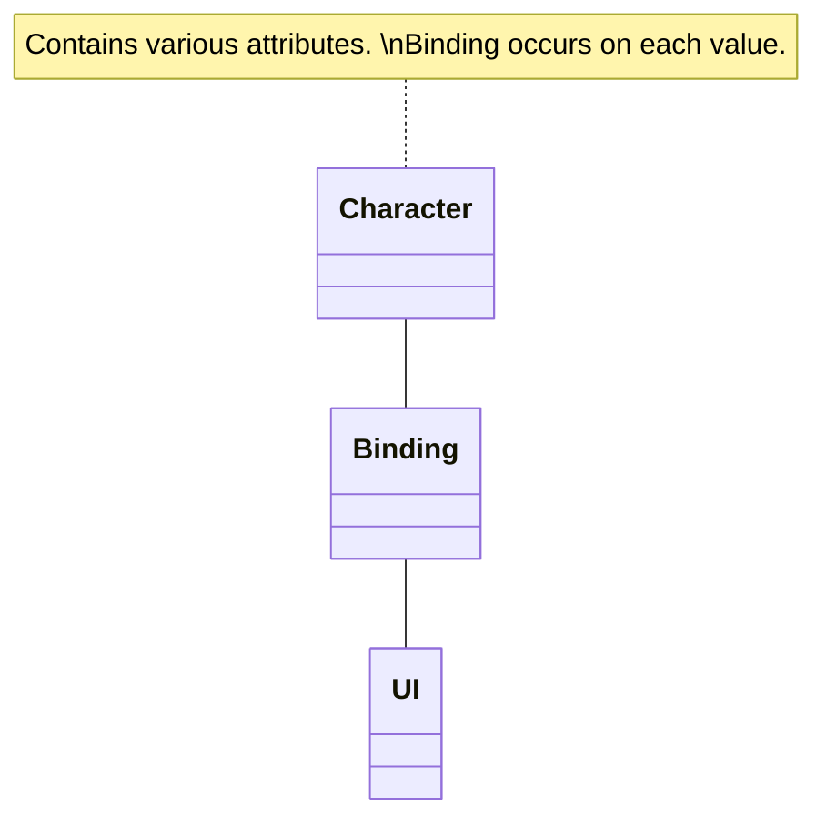
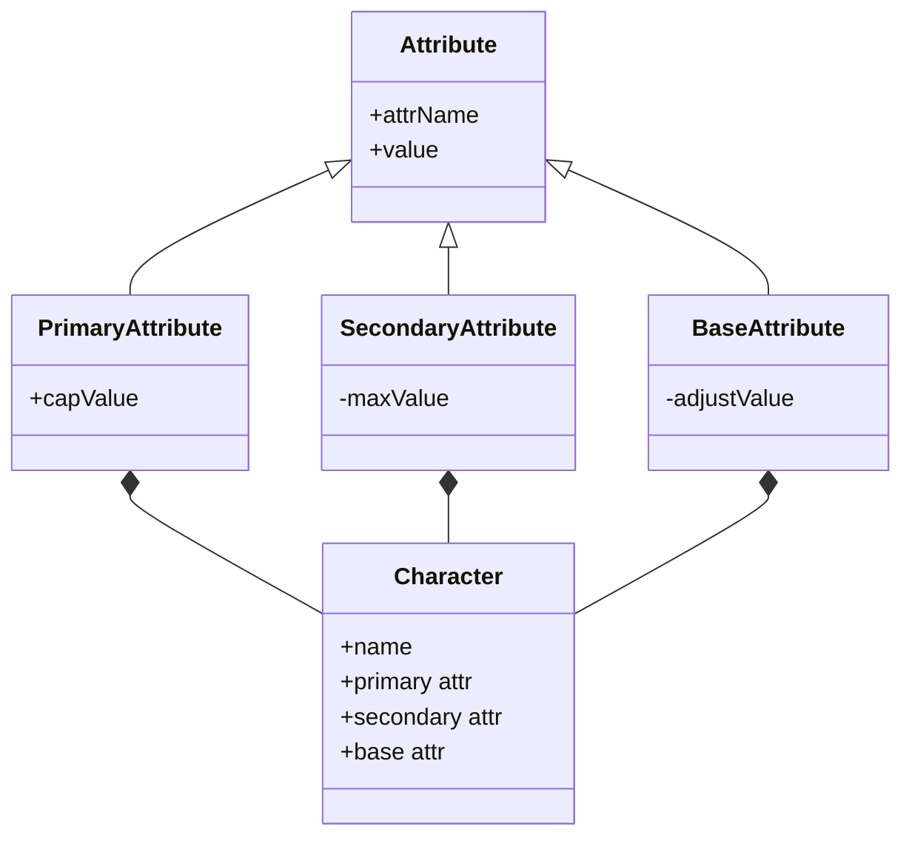

```mermaid
classDiagram
	Character -- Binding
	Binding -- UI

	note for Character "Contains various attributes. \nBinding occurs on each value."
```

```mermaid
classDiagram
	Attribute <|-- PrimaryAttribute
	Attribute <|-- SecondaryAttribute
	Attribute <|-- BaseAttribute
	PrimaryAttribute *-- Character
	SecondaryAttribute *-- Character
	BaseAttribute *-- Character
	class Character {
		+name
		+primary attr
		+secondary attr
		+base attr
	}
	class Attribute{
		+attrName
		+value
	}
	class PrimaryAttribute {
		+capValue
	}
	class SecondaryAttribute {
		-maxValue
	}
	class BaseAttribute {
		-adjustValue
	}	
```
